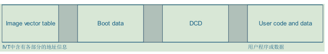
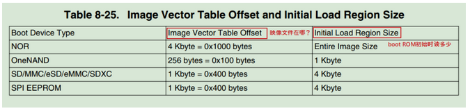

## ARM裸机程序之Makefile解读

讨论一个imx6ull裸机程序的Makefile，以及编译打包过程。涉及到gcc、ld、ar、objcopy、objdump、mkimage等工具的介绍。

这个Makefile是这样式儿的：

```
PREFIX=arm-linux-gnueabihf-
CC=$(PREFIX)gcc
LD=$(PREFIX)ld
AR=$(PREFIX)ar
OBJCOPY=$(PREFIX)objcopy
OBJDUMP=$(PREFIX)objdump

led.img : start.S  main.c
	$(CC) -nostdlib -g -c -o start.o start.S
	$(CC) -nostdlib -g -c -o main.o main.c	
	
	$(LD) -T imx6ull.lds -g start.o main.o -o led.elf 
	
	$(OBJCOPY) -O binary -S led.elf  led.bin
	$(OBJDUMP) -D -m arm  led.elf  > led.dis	
	mkimage -n ./tools/imximage.cfg.cfgtmp -T imximage -e 0x80100000 -d led.bin led.imx
	dd if=/dev/zero of=1k.bin bs=1024 count=1
	cat 1k.bin led.imx > led.img

clean:
	rm -f led.dis  led.bin led.elf led.imx led.img *.o
```

目录结构为：
```
$  tree -a              
.
├── 1k.bin
├── imx6ull.lds
├── led.c
├── led.h
├── main.c
├── Makefile
├── start.S
└── tools
    ├── imximage.cfg.cfgtmp
    ├── mkimage
    ├── u-boot-dtb.imx
    └── uuu.exe
```

### 编译与链接

首先，说一下C/C++源码是如何编译成可执行程序的，需要经过下面4个步骤：
> 1. 预编译： gcc -E test.c -o test.i
> 2. 汇编： gcc -S test.i -o test.s(汇编文件)
> 3. 编译： gcc -c test.s -o test.o(目标文件)
> 4. 链接： gcc test.o -o test(可执行程序)

再来看一下下面这几个概念：

- gcc是一组编译工具的总称，它通过调用其他程序来实现将程序源文件编译成目标文件的功能。编译时，它首先调用预处理程序(cpp)对输入的源程序进行处理，然后调用cc1将预处理后的程序编译成汇编代码，最后由as将汇编代码编译成目标代码。gcc具有丰富的命令选项，可以控制编译的各个阶段，满足用户的各种编译需求。
- binutils提供了一系列用来创建、管理和维护二进制目标文件的工具程序，如汇编器（as）、链接器（ld）、静态库归档工具（ar）、反汇编工具（objdump）、目标拷贝工具（objcopy）、elf结构分析工具（readelf）、无效调试信息和符号的工具（strip）等。通常，binutils与gcc是紧密结合的，没有binutils的话，gcc是不能单独完成工作的。

所以gcc相当于一个程序入口，可以完成很多功能，但是具体功能的实现是由binutils中的工具完成的。所以，上面的【3】(编译)可以直接用as工具，写成这样：`as test.s -o test.o`，【4】(链接)也可以直接调用ld工具，写成这样：`ld test.o -o test`。

### Makefile分析

make过程主要生成两个镜像文件：led.imx、led.img，文档里是这么描述的：

> imx文件开头就是IVT，可以把它烧写到TF卡1024偏移位置处；img文件开头是1024字节的0值数据，后面才是IVT等，它可以通过win32diskimger等工具直接烧写到TF卡0偏移位置处。

这个IVT是指Image Vector Table，说到这就不得不提一下imx6的启动流程：

> 1. imx6上电启动之后，首先运行芯片内置的boot ROM程序，boot ROM确定启动设备，进行一些初始化，然后读取IVT，进行寄存器初始化，最后运行start.S中的_start函数进入用户的main函数。
> 2. IVT、Boot Data structures、DCD是imx6启动时的重要数据和配置。IVT中包含Boot Data structures、DCD地址定位的信息。boot ROM根据这些地址定位找到DCD的存储位置，使用DCD中的配置参数，来初始化DDR，配置时钟，以及其他启动时必要的硬件设置。Boot Data structures中包含数据拷贝的目标地址和长度，boot ROM会在必要的检查和上述的初始化之后，将启动设备中的数据拷贝到该目标地址中(通常是DDR)，然后跳转到IVT中的entry执行程序镜像。

一步一步来分析一下Makefile：
1. 第8行指定了编译目标（led.img）和依赖（start.S led.c main.c）。
2. 第9~11行就是将源码编译成目标文件，需要注意“-nostdlib”选项：

> -nostdlib作用：不链接系统标准启动文件和标准库文件，只把指定的文件传递给连接器。这个选项常用于编译内核、bootloader等程序，它们不需要启动文件、标准库文件。生成一个C程序的可执行文件时编译器通常会在我们的代码上加上几个被称为启动文件的crt1.o,crti.o,crtend.o,crtn.o等，他们是标准库文件。C语言程序执行的第一条指令并不是main函数，而是启动文件中的_start函数，这些代码设置C程序的堆栈等，然后调用main函数。他们依赖于操作系统，在裸板上无法执行，需要我们自己写。

所以，源码目录中的start.S文件就是我们自己写的启动文件，它设置好堆栈后调用main函数。

3. 第13行是链接过程，将目标文件链接成可执行程序，这里用-T参数指定了一个链接脚本，链接脚本的一个主要目的是描述输入文件中的段如何被映射到输出文件中，并控制输出文件的内存排布。脚本内容如下：

```
SECTIONS {
    . = 0x80100000;

    . = ALIGN(4);
    .text      :
    {
      *(.text)
    }

    . = ALIGN(4);
    .rodata : { *(.rodata) }

    . = ALIGN(4);
    .data : { *(.data) }

    . = ALIGN(4);
    __bss_start = .;
    .bss : { *(.bss) *(.COMMON) }
    __bss_end = .;
}
```

这个脚本只使用“SECTIONS”来描述输出文件的内存布局，并指定代码段的地址为0x80100000，4字节对齐。

4. 第15行是将elf文件的内容复制到bin文件，-S参数表示在复制的时候不复制ELF里面的重定位信息和符号信息。
5. 第16行是反汇编出led.dis文件，我发现这个文件没有用到。
6. 第17行使用mkimage工具制作imx镜像文件，输入为bin文件，指定入口地址0x80100000。
7. 第18~19行制作img镜像，其实就是在imx镜像前面加了1k字节的无效数据。
8. clean表示清除编译输出的文件

Makefile基本就这些功能，是一个比较简单的Makefile，下面重点分析一下镜像文件的制作。


### 镜像文件的制作

再来回顾一下imx6的boot ROM启动流程：初始化CPU、时钟等，初始化内存(DDR)，初始化启动设备(SD/TF卡或EMMC)，从启动设备上把程序读入内存，运行内存的程序。所以，boot ROM程序需要知道按怎样的参数初始化硬件设备，从启动设备哪个位置读程序，读多大的程序，复制到哪里去。因此，启动设备上，不能仅烧写bin文件(程序代码)，还需要添加额外的信息，比如位置信息、硬件配置参数数据，以供boot ROM参考进行一系列的启动流程动作。
总结起来，烧写在 EMMC、SD 卡或是 TF 卡上的，除了程序本身，还有位置信息、DCD 信息，这些内容合并成一个镜像文件，如下图：



这4部分内容合并成为一个镜像文件，烧写在EMMC、SD卡或TF卡等启动设备的某个固定地址，boot ROM程序去这个固定地址读出镜像文件。启动设备不同，固定地址也不同，具体值参照数据手册即可：



- IVT
  IVT中是一系列的地址，boot ROM程序会根据这些地址来确定映像文件中其他部分在哪里。     
- Boot data
  用来表示整个镜像文件应该被复制到哪里去，以及它的大小。boot ROM程序就是根据它来把整个镜像文件复制到内存中去的。
- DCD
  就是设备的配置信息，里面保存有一些寄存器值。
- User code and data
  就是用户代码编译出来的程序和数据。

上面每一部分具体的数据格式可参考数据手册。
理解了镜像文件的组成，下一步就是制作镜像的具体步骤了：

1. 确定入口地址entry：
  我们的程序运行时要放在内存中哪一个位置，这是我们决定的。它被称为入口地址、链接地址(本例中为0x80100000)。
2. 确定镜像文件在内存中的地址start：
  boot ROM程序启动时，会把镜像文件中的“initial load region”部分读出来，“initial load region”里含有IVT、Boot data、DCD。boot ROM根据DCD初始化设备后，再把整个镜像文件读到内存。在启动设备上，“initial load region”之后紧跟着我们的程序，也就是我们程序的前面放着“initial load region”。假设“initial load region”的大小为 load_size，那么在内存中“initial load region”的位置start = entry – load_size(地址是递增的)。
3. 确定IVT在内存中的地址self：
  我们知道IVT在启动设备上某个固定的位置：ivt_offset。那么在内存中它的位置可以如下计算：
  `self = start + ivt_offset = entry – load_size + ivt_offset。`
4. 确定Boot data在内存中的地址boot_data：
  IVT的大小是32字节，IVT之后就是Boot data，而IVT中的boot_data值表示Boot data在内存中的位置，计算如下：
  `boot_data = self + 32 = entry – load_size + ivt_offset + 32。`
5. 确定DCD在内存中的地址dcd：
  Boot data的大小是12字节，Boot data之后就是DCD，而IVT中的dcd值表示DCD在内存中的位置，计算如下：
  `dcd = boot_data + 12 = entry – load_size + ivt_offset + 44。`
6. 写入DCD的数据：
  DCD是用来初始化硬件的，特别是初始化DDR，而DDR的初始化非常的复杂、专业，我们一般是使用硬件厂家提供的代码。在后面的程序中你可以看到，我们是使用类似下面的指令来制作映象文件：
  `./tools/mkimage -n ./tools/imximage.cfg.cfgtmp -T imximage -e 0x80100000 -d led.bin led.imx`
  上述命令中的imximage.cfg.cfgtmp就是厂家提供的，基本都是对寄存器的写操作。
7. 写入用户程序

经过上述 7 个步骤，整个映像文件就构造出来了，img文件只是在imx文件基础上前面加了1k数据，是为了满足IVT offset=1k byte。img文件可以直接烧录到启动设备当中了。从Makefile中可以看出，镜像制作主要是mkimage工具完成的，只要输入程序入口地址、DCD命令、应用程序二进制文件，即可在内部完成各数据的计算和组装。

PS：上述计算出的地址均指内存中的地址，而不是启动设备中的地址！
